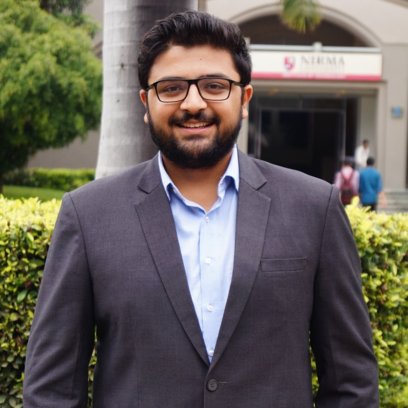

hello world!  

  i graduated with a master of science in software development from boston university. i am proficient in many programming languages and my key interest areas are mobile application development and server side development. i am passionate about android, flutter, ktor and exploring many other technologies. i aspire to bring positive, beautiful, and secure changes through my work.

_i am very passionate about Formula 1 and music._

## news

- jan 2021: graduated from boston university with masters of science in software development.
- aug 2020: passed the google associate android developer kotlin exam.
- oct 2019: graduated from nirma university with a bachelor's degree in computer engineering.
<!-- ## open-source projects -->

<!-- ### using ecg for biometric authentication [[code](https://github.com/amanbasu/ecg-authentication)] [[blog](https://medium.com/intel-software-innovators/ecg-to-identify-individuals-from-data-to-deployment-74cce404f9f0)]

  

- ecg signals from smartwatch are passed to a _siamese network_ hosted on aws.
- the network converts the ecg signals to frequency spectrogram and verifies the user.
- ecg is unique for an individual and is very promising for this task.
  [reference](https://ieeexplore.ieee.org/document/7353191)

<!-- img src="https://media.giphy.com/media/dugb9or2ktw4ab4khy/giphy.gif" width="40%"/><br/-->
<!-- *source: security heartbeat gif by sandia national labs*

### object detection in satellite images [[code](https://github.com/amanbasu/ship-detection)]

  

- a deep network to detect ships in oceans from real-time satellite images using _yolov3_.
- trained a customized model on _darknet_ and hosted it on aws to download the latest satellite images from _planet labs_, make predictions, & send the detected object coordinates to the user.

### 3d prostate segmentation of mr images using fcnn [[project page](https://amanagarwal.io/3d-prostate-segmentation/)]

    

- our enhanced v-net model outperformed the results of the baseline in the _promise12_ challenge.
- the model was enhanced by tweaking its architecture, adding dilation, and deep supervision. we improved the accuracy by 6%.

  

### predicting the dynamics of tokamak discharge [[paper](https://arxiv.org/abs/2007.06230)]   (department of atomic energy, india)

- the aim of the project was to anticipate the phenomenon of major disruption in plasma confinement for _aditya tokamak_.
- we were able to anticipate the disruption of plasma 12 ms prior to the actual disruption (4 ms earlier than the state-of-the-art models).
- input features included the readings of various diagnostics like plasma current, mirnov oscillations, loop voltage, bolo meter readings, and many other.

  
  
our model predicting the disruption in tokamak plasma in real time.

### speech emotion recognition [[code](https://github.com/amanbasu/speech-emotion-recognition)]

    

- prediction of human emotions from raw audio using _iemocap_ database.
- bidirectional lstm was used along with local attention mechanism to focus on the part of speech which influence the emotion more.
- the architecture was trained on nvidia k80 system and gave results comparable to the state-of-the-art models.

### autonomous car [[code](https://github.com/amanbasu/autonomous-car-prototype)] [[paper](https://amanagarwal.io/files/autocar.pdf)]

  

- a self-driving rc car that can maneuver itself on an indoor, hand-made track.
- convolutional neural network was used to classify the direction of car from dashcam images.
- the model was deployed on raspberry pi for real-time predictions.

  

 -->

<!--
## other projects
### analysis of crop health
- detection of crop species and diseases using image data.
- predicting the severity of disease using the image along with other parameters like soil, weather, region etc.
- trained the network using a modified loss function, taking two classes into account, specie and disease.

<!--
#### breaking bill [[code](https://github.com/amanbasu/breaking-bill)]
- android application to add expenses to a list along with the members who share it.
- users can generate bills and split monthly expenses among members according to their contributions.
<!--
#### file sender application [[code](https://github.com/amanbasu/wifi-p2p)]
- an android application to send files from one android device to another.
- the application used wifi direct and socket programming.
- it was capable to sharing any type of file format like image, audio, video, text, pdf, doc, xls etc.
<!--
#### hospital management system [[code](https://github.com/amanbasu/hospital-management-system)]
- a software developed on javafx to store hospital details like patient information, staff information, department details etc. in sql database.
-->

<!--
## blog posts
- [ship detection in satellite images from scratch](https://medium.com/intel-software-innovators/ship-detection-in-satellite-images-from-scratch-849ccfcc3072): detecting ships in satellite images using yolo-v3 network.
- [ecg to identify individuals](https://medium.com/intel-software-innovators/ecg-to-identify-individuals-from-data-to-deployment-74cce404f9f0): using ecg signals to authenticate an individual by a siamese network.
- [to be a solutions architect](https://medium.com/@amanag.11/to-be-a-solutions-architect-3990135ac2fe): a guide to the aws certified solutions architect associate exam.

<!--
## certifications and courses
- [aws certified solutions architect - associate](https://www.youracclaim.com/badges/ba0dc25c-3b38-4b27-878a-639eb0d888bc/public_url)
- [pcap certified associate in python programming](https://www.youracclaim.com/badges/32c3c723-97d9-444f-bea6-5e766e5394d6/public_url)
- deep learning specialization (5 courses), prof. andrew ng.
- machine learning by stanford university, prof. andrew ng.
- introduction to big data by university of california san diego.
- fundamentals of accelerated computing with cuda, by nvidia.
- computer vision specialization by university of buffalo.
-->

## hobbies & interests

- hip-hop, rap and edm.
- technology.
- formula 1, basketball and football.
- cooking.

  
  
  
  

 
 
